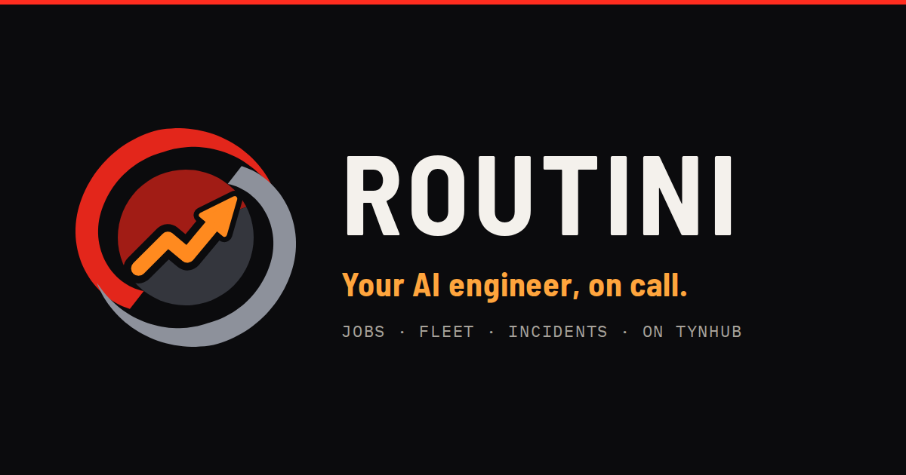

<p align="center">
  <a href="https://routini.tynhub.com"></a>
</p>

<p align="center">
  <a href="https://routini.tynhub.com"><b>routini.tynhub.com</b></a> ·
  <a href="https://routini.tynhub.com/docs/getting-started">Getting started</a> ·
  <a href="https://github.com/nvasion/routini-runner">routini-runner</a> ·
  <a href="brand/README.md">Brand</a>
</p>

# Routini

**An AI engineer platform.** Routini runs jobs for you: scheduled checks, server
chores, incident triage and coding work done by agents that open pull
requests. Every run is recorded step by step, anything risky waits for a person
to approve it, and you can watch it all happen live.

Open source under the [AGPL-3.0](LICENSE). Self-host it, or use it hosted on
TynHub at [routini.tynhub.com](https://routini.tynhub.com) (alpha, open signup).

## How it works

```
Trigger ─▶ Job ─▶ Run ─▶ Steps
manual        trigger    action    http · command (runner or ssh) · imap · factory
cron (tz)     + steps    agent     a coding agent in a container → PR
webhook                  approval  waits for a person
alert
```

- A **job** is a trigger plus an ordered list of steps. Each step has a `when`
  rule (`on_success` · `on_failure` · `always`, relative to the last step that
  ran), and optional retries and timeout.
- A **run** is one execution. It is durable: every transition is stored in
  Postgres, so restarts, crashes and multiple workers are safe. A step left
  running by a dead worker is retried or failed as "worker lost".
- **Approvals** park the run without holding a worker. Approve or deny from the
  inbox or the run page; the step's `minRole` decides who may.
- **Agent steps** run Claude Code in an ephemeral container (see
  [agents/](agents/README.md)), stream what it does into the timeline, run your
  done-check (e.g. `npm test`), push a branch and open the pull request.
- Every log line, output and error is **redacted** against the secrets that
  step was given.
- **Environments** are persistent workspaces: a container plus a `/workspace`
  volume, optionally with your repository cloned in. Open a terminal in one from
  the console, or point agent steps at it (`environmentId`). Agents then work in
  their own git worktree inside it, so your checkout is untouched and you can
  inspect the result. Stopping keeps `/workspace`; idle environments stop on
  their own.
- **Policy** gates steps before they run: ordered rules (first match wins) can
  require an approval from a given role, or block a step outright, by step kind,
  action type, SSH host tags and groups, agent result, repository host, or
  whether an agent runs in an environment. The job editor previews each step's
  decision as you edit.
- The **credential broker** keeps secrets out of sandboxes. Agent and
  environment containers sit on an internal network whose only way out is the
  egress proxy. They hold placeholders; the proxy enforces the org's egress
  allow-list and adds the real model key or integration token to requests for
  the hosts it belongs to. Blocked connections are shown on the run.
- **MCP servers** (remote, HTTP) give agents extra tools; their headers are
  stored like any other secret and brokered the same way.
- **Factory** is an integration: a `factory` action starts an orchestration or a
  PRD execution on Factory and waits for it, recording the pull request.
- **Fleet:** servers connect with [routini-runner](https://github.com/nvasion/routini-runner)
  (Apache-2.0), a small agent that only dials out: no inbound ports and no SSH
  keys stored in Routini. Enroll one with a one-time install command; it reports
  health every minute and runs command steps and terminals as its own user.
  SSH hosts keep working, and commands and terminals behave the same on both.
  Terminal sessions on hosts are admin-only and audited.
- **The SRE loop:** monitoring tools (Alertmanager, Grafana, any webhook) post
  alerts to `/api/alerts/:org`. A firing alert opens an **incident** (repeats are
  deduplicated) and starts every job with a matching **alert trigger**. Steps can
  use `{{alert.labels.instance}}`, `{{steps.diag.stdout}}` and friends, and a
  command step can target **the alert's host**. Template values reach shells as
  variables, never as command text, so hostile labels stay inert. When the
  alert resolves, Routini drafts a **postmortem** from what actually happened.
- **Routini as an MCP server:** connect Claude Code (or any MCP client) to
  `/mcp` with an API token from Settings → API tokens:
  `claude mcp add --transport http routini https://routini.example.com/mcp --header "Authorization: Bearer rtk_…"`.
  Tools: runs, jobs, the fleet, incidents and approvals (read), `run_job`,
  `run_command` on fleet servers, `cancel_run`, incident notes and resolving.
  Commands are ordinary runs under org policy; there is deliberately no approve
  tool. Agent steps can opt in to the same tools (`routini: true`) through a
  token that lives only for the step.
- **Sign in with TynHub** (any OIDC provider): "Continue with TynHub" on the
  login page. Owners can link an org to a TynHub org so its members join on
  sign-in. A new sign-in never attaches itself to an existing account by email;
  password users link TynHub from their account menu.

## The console

Inbox (what needs you, what's live, what's next) · Runs · live run timeline ·
Incidents and postmortems · Jobs and the job editor · Fleet · Environments ·
Integrations and MCP servers · Settings (including Policy and Alerts). The right-hand **dock** shows
your servers with health checks, and a live view of any run; it collapses or
pops out into its own window. Three themes: **Routini** (default), **TynHub
dark** and **TynHub light**.

## Quick start (development)

Needs Node 22 and, for agent steps, Docker.

```bash
make install
make dev          # API on :3001 (embedded Postgres, worker inline) + console on :5173
```

Open http://localhost:5173 and sign in as `admin@routini.dev` / `changeme`
(created on first boot in development only). Data lives in `server/data/pg`.

To run agent steps locally, build the image and add a model key in
Settings → Models:

```bash
make agents
```

## Self-hosting with Docker

```bash
cp .env.example .env        # set JWT_SECRET, COOKIE_SECRET, CREDENTIALS_MASTER_KEY
make agents                 # build routini/agent-claude:latest
echo "DOCKER_GID=$(stat -c %g /var/run/docker.sock)" >> .env
docker compose up --build -d
```

Open http://localhost and create the first account: it owns the server, and
further signups are closed (`ROUTINI_SIGNUP`). The stack is Postgres, the API,
a worker (`docker compose up --scale worker=3` for more) and nginx.

Turn on the credential broker (recommended; required in hosted mode for agent
steps) by adding `COMPOSE_PROFILES=broker` and `ROUTINI_EGRESS_SECRET` to `.env`:
this adds the `egress` service, and sandboxed containers then reach the network
only through it.

The API and the worker reach Docker (the API runs environments and their terminals; the worker runs agent containers). Mounting the socket gives them
root-equivalent access to that host, so for production point `DOCKER_HOST` at a
separate runner host (`ssh://…` or TLS `tcp://…`) instead.

Back up the database and `CREDENTIALS_MASTER_KEY` together: without the key,
stored secrets cannot be decrypted.

## Configuration

| Variable | Default | Meaning |
|---|---|---|
| `DATABASE_URL` | — | Postgres. Unset: embedded Postgres (PGlite) in `ROUTINI_DATA_DIR`, with the worker inline. |
| `ROUTINI_DATA_DIR` | `./data/pg` | Embedded Postgres directory. |
| `ROUTINI_MODE` | `selfhost` | `hosted` = plan limits, open signup, private network targets blocked. |
| `ROUTINI_SIGNUP` | `first-user-only` (hosted: `open`) | or `closed`. |
| `ROUTINI_INLINE_WORKER` | on without `DATABASE_URL` | Run scheduler + queue in the API process. |
| `JWT_SECRET`, `COOKIE_SECRET` | required in production | Session signing. |
| `CREDENTIALS_MASTER_KEY` | required in production | 32 bytes (hex/base64). Encrypts every stored secret. |
| `CLIENT_URL` | `http://localhost:5173` | Console origin (CORS). |
| `DOCKER_HOST` | local socket | Where agent containers run. |
| `ROUTINI_AGENT_IMAGE_CLAUDE` | `routini/agent-claude:latest` | Agent image (also `_OMNIMANCER`, `_OPENCODE`). |
| `ROUTINI_WORKER_CONCURRENCY` | `4` | Runs per worker process. |
| `ROUTINI_ENV_IMAGES` | agent images | Hosted mode: images environments may use (comma separated). Self-host allows any image. |
| `ROUTINI_PUBLIC_URL` | `CLIENT_URL` | Where runners and monitoring tools reach this server (install commands and the alert endpoint use it). |
| `ROUTINI_AGENT_API_URL` | the public URL | Where agent containers reach this server for Routini's MCP tools. |
| `ROUTINI_OIDC_ISSUER`, `ROUTINI_OIDC_CLIENT_ID`, `ROUTINI_OIDC_CLIENT_SECRET` | — | Sign in with TynHub (or any OIDC provider). Redirect URI: `<public URL>/api/auth/oidc/callback`. |
| `ROUTINI_OIDC_NAME`, `ROUTINI_OIDC_SCOPES` | `TynHub`, `openid profile email orgs` | Button label; requested scopes (filtered to what the provider supports). |
| `ROUTINI_EGRESS_CONTROL_URL`, `ROUTINI_EGRESS_SECRET` | — | Credential broker: the egress proxy's control API and its shared secret. Both set = broker on. |
| `ROUTINI_EGRESS_PROXY_HOST`, `ROUTINI_EGRESS_PROXY_PORT` | `routini-egress`, `3128` | The proxy as sandboxed containers see it (a network alias). |
| `ROUTINI_EGRESS_CONTAINER` | `routini-egress` | Proxy container, attached to each org's sandbox network. |
| `ROUTINI_SANDBOX_NETWORK_PREFIX` | `routini-sb` | Per-org internal Docker networks. |
| `ROUTINI_CONTAINER_RUNTIME` | Docker's default | OCI runtime for agent and environment containers. `runsc` (gVisor) gives each one its own kernel; install it on the Docker host first. |
| `ROUTINI_CONTAINER_PIDS_LIMIT` | `512` | Process cap per agent or environment container. |
| `ROUTINI_EGRESS_CA_DIR` | — | Egress proxy only: where its CA persists (ephemeral if unset). |
| `SEED_EMAIL`, `SEED_PASSWORD` | dev: admin@routini.dev / changeme | First account on an empty database. |
| `SMTP_*` | — | Run-finished emails (per-org settings decide who gets them). |

## Multi-tenancy and security

- Everything belongs to an **org**; people have a role in each (owner, admin,
  member, viewer). Non-members get 404 for an org's resources.
- Tenant tables use Postgres **row-level security**: every query runs as a
  restricted role, and a query without the org context sees no tenant rows. This
  is tested on embedded Postgres and on a real Postgres with a non-superuser
  owner.
- Secrets (model keys, integration tokens, SSH keys, webhook secrets) are
  AES-256-GCM encrypted, bound to their org and key, and write-only over the
  API.
- **Limits** per org: concurrent runs, agent minutes per day, model budget per
  day. Plans set the ceiling; admins can tighten it. Self-hosted orgs default to
  10 concurrent runs and no daily caps; hosted free orgs to 2 and 120 minutes.
- With the credential broker on, sandboxed containers never receive real
  credentials and can only reach allow-listed hosts. Without it (self-host
  default), agents get the keys they are scoped to as environment variables.

## API

Session: `POST /api/auth/signup | login | logout`, `GET /api/auth/me`. Browser
sessions use an HTTP-only cookie plus an `X-CSRF-Token` header on mutations;
scripts can use `Authorization: Bearer <token>` instead.

Under `/api/orgs/:org`:

| Area | Endpoints |
|---|---|
| Org | `GET/PUT /`, `GET/POST /members`, `PUT/DELETE /members/:userId` |
| Jobs | `GET/POST /jobs`, `GET/PUT/DELETE /jobs/:id`, `POST /jobs/:id/run` |
| Runs | `GET /runs`, `GET /runs/:run`, `GET /runs/:run/events`, `GET /runs/:run/stream` (SSE, resumes from `Last-Event-ID`), `POST /runs/:run/cancel`, `POST /runs/:run/rerun`, `POST /runs/:run/steps/:idx/approve` and `…/deny` |
| Inbox | `GET /inbox`, `GET /stream` (SSE of run changes) |
| Hosts | `GET/POST /hosts`, `GET/PUT/DELETE /hosts/:id`, `POST /hosts/:id/check`, `GET /hosts/:id/events`; WebSocket `/hosts/:id/terminal` (admin) |
| Runners | `POST /runners/enrollments` (admin), `GET /runners`, `DELETE /runners/:id` (admin) |
| Incidents | `GET /incidents`, `GET /incidents/:number`, `POST /incidents/:number/resolve`, `…/notes`, `…/postmortem/generate`, `PUT …/postmortem`; `GET /alerts/settings`, `POST /alerts/token` (admin) |
| Tokens | `GET/POST /tokens`, `DELETE /tokens/:id`; `PUT /tynhub` (owner: link a TynHub org) |
| Environments | `GET/POST /environments`, `GET/PUT/DELETE /environments/:id`, `POST /environments/:id/start`, `…/stop`, `…/exec`; WebSocket `…/terminal` |
| Integrations | `GET /integrations`, `PUT/DELETE /integrations/:id`, `POST /integrations/:id/test` |
| Settings | `GET/PUT /settings`, `GET /credentials`, `PUT/DELETE /credentials/:key` |
| Policy | `GET/PUT /policy` (rules + egress allow-list), `POST /policy/evaluate` (dry run for steps) |
| MCP servers | `GET/POST /mcp-servers`, `PUT/DELETE /mcp-servers/:id`, `POST /mcp-servers/:id/test` |

MCP: `POST /mcp` (Streamable HTTP, stateless) with `Authorization: Bearer rtk_…`.
Sign-in: `GET /api/auth/providers`, `GET /api/auth/oidc/start`, `GET /api/auth/oidc/callback`.
API tokens also work as Bearer tokens on `/api/orgs/:org/*` for their org.

Alerts: `POST /api/alerts/:org` with `Authorization: Bearer <org alert token>`
(Alertmanager and Grafana webhooks, or generic JSON). Runners: `POST
/api/runner/enroll` (one-time token) and the WebSocket `/api/runner/connect`; the
wire protocol is [PROTOCOL.md](https://github.com/nvasion/routini-runner/blob/main/PROTOCOL.md).

Webhook triggers: `POST /api/hooks/:org/:jobId` with
`Authorization: Bearer <secret>` (works with Alertmanager) or
`X-Routini-Signature: sha256=<HMAC of the body>`. The JSON body is kept on the
run.

## Development

```
server/src/
  config.ts  bootstrap.ts  index.ts (API)  worker.ts (worker)  app.ts
  db/        Postgres + PGlite drivers, migrations, tenancy (org/system transactions)
  repos/     data access: identity, credentials, integrations, settings, jobs, runs, hosts,
             environments, policy, mcp, runners, incidents
  engine/    spec, engine (run state machine), worker (queue), scheduler, executors,
             agent (+ agentStream parser), hub (SSE fan-out), notify,
             environments, policy, factory, alerts, template, prepare, postmortem
  runner/    runner gateway (routini-runner connections) and worker-side command execution
  mcp/       Routini as an MCP server (tools over the same repos and policy)
  egress/    credential broker: egress proxy (egress.ts), CA, broker client
  routes/    org-scoped HTTP APIs, hooks
  http/      auth, org context, SSE, errors, environment and host terminals
  services/  http / ssh / imap / email executors, Docker
client/src/  lib (api, auth, theme, hooks), shell (top bar, nav, dock), pages, styles
agents/      agent image contract, Claude Code image, fake replay image
tests/       server tests (Vitest); client tests live next to their code
```

```bash
make test           # server (embedded Postgres) + client
make test-pg        # needs ROUTINI_TEST_PG_URL: real Postgres, non-superuser owner
make test-docker    # needs Docker: agents, environments, the credential broker and routini-runner, for real
```

## License

[AGPL-3.0-only](LICENSE). If you run a modified Routini as a network service,
you must offer its source to the service's users.
